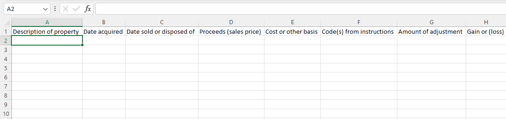
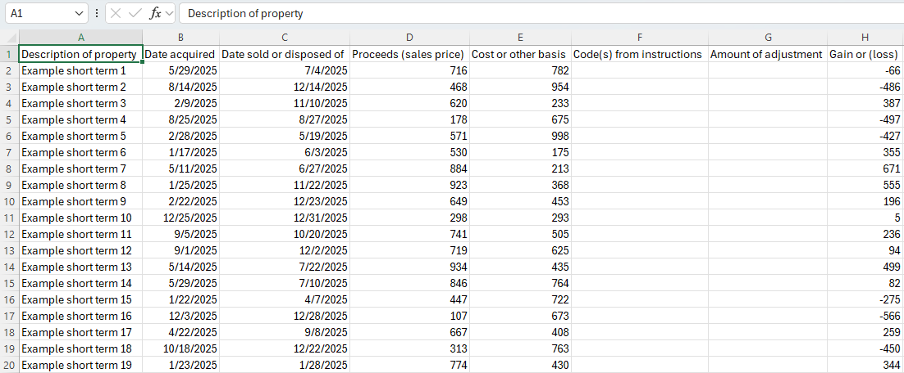
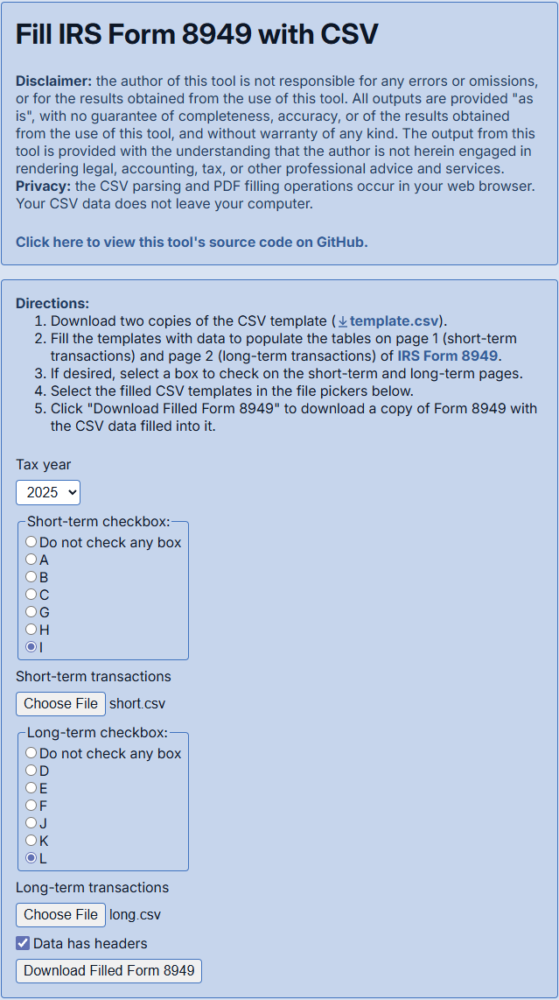
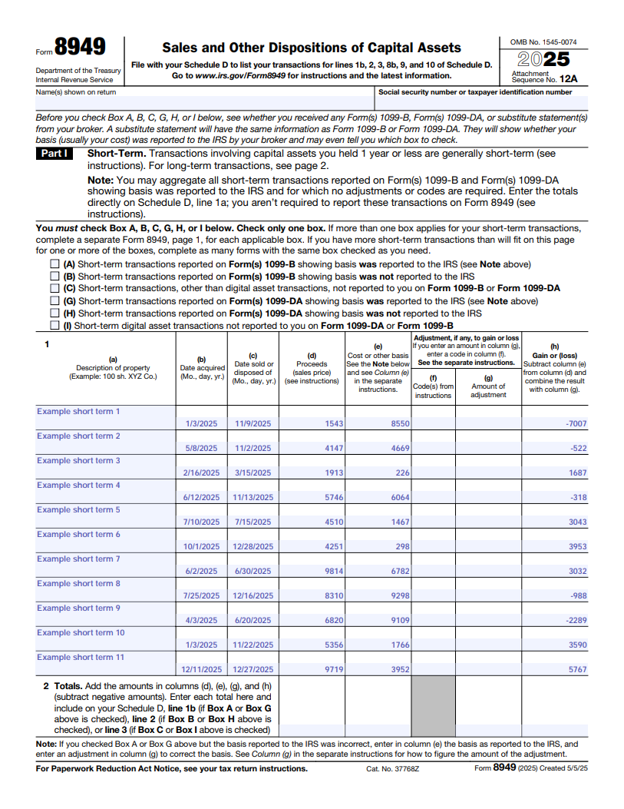

# fill-8949-with-csv

> [!IMPORTANT] 
> The author of this tool is not responsible for any errors or omissions, or for the results obtained from the use of this tool. All outputs are provided "as is", with no guarantee of completeness, accuracy, or of the results obtained from the use of this tool, and without warranty of any kind. The output from this tool is provided with the understanding that the author is not herein engaged in rendering legal, accounting, tax, or other professional advice and services.

Web app that fills [IRS Form 8949](https://www.irs.gov/form8949) with data from a CSV file.

## Usage demonstration

1. Download two copies of the CSV template from the web app:

2. Fill the templates with data to populate the tables on page 1 (short-term transactions) and page 2 (long-term transactions) of IRS Form 8949:

3. Select the filled CSV templates in the file pickers on the web app:

4. Click "Download Filled Form 8949" to download a copy of Form 8949 with the CSV data filled into it:

